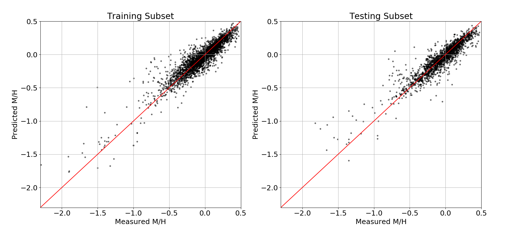
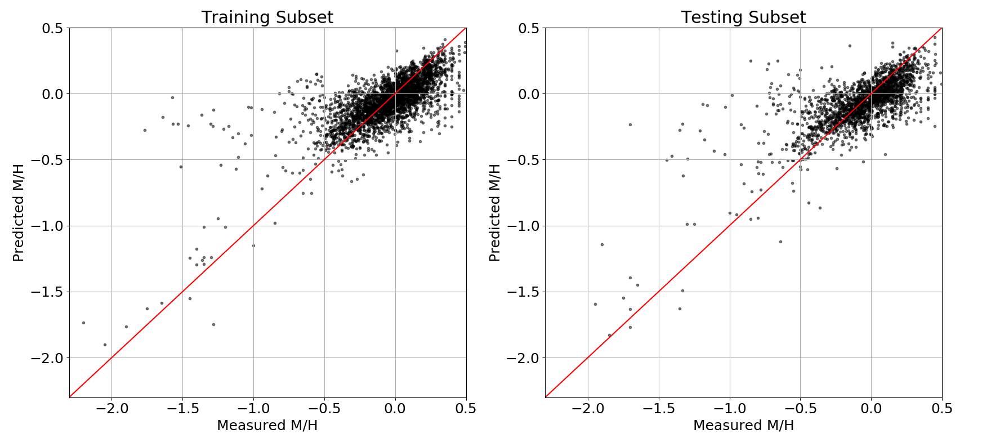

# Photometric Metallicity Relationship for K and M Dwarfs

This provides the results of a photometric metallicity relationship calibrated using a Gaussian Process Regressor (implemented in [*scikit-learn*](https://scikit-learn.org/stable/modules/generated/sklearn.gaussian_process.GaussianProcessRegressor.html), specifically with v=0.20.3) calibrated using photometry and astrometry from [*Gaia*](https://www.cosmos.esa.int/web/gaia/dr2), [2MASS](https://irsa.ipac.caltech.edu/Missions/2mass.html), [AllWISE](http://wise2.ipac.caltech.edu/docs/release/allwise/) and [Pan-STARRS](https://panstarrs.stsci.edu), and metallicity measurments from [APOGEE](https://www.sdss.org/surveys/apogee-2/) and [Hejazi et al. (2020)](https://iopscience.iop.org/article/10.3847/1538-3881/ab563c), as detailed in [Medan, Lepine and Hartman (2021)](https://arxiv.org/abs/2102.10210). These results include two calibrated relationships, one for stars of Luminosity Class V with temperatures 3500 < T < 5280 K and the other for stars of Luminosity Class V with temperatures 2850 < T < 3500 K. Both relationships are applicable over the metallicity range -2.3<[M/H]<0.5 and also utilize photometric cuts to remove possible unresolved binaries that can contaminate datasets. From the training and testing subsets used to calbibrate the relationships, the 3500 < T < 5280 K sample resulted in a 1-sigma scatter of 0.12 dex:

and the 2850 < T < 3500 K sample resulted in a 1-sigma scatter of 0.21 dex:

This repository will provide the resuting Gaussian Process Regressors, photometric cuts for removing possible unresolved binaries and example code that demonstrates how these can be used to estimate metallicities and the confidence on these estimates. As a note, this code is written to specifically use the resulting cross-match data from [Medan, Lepine and Hartman (2021)](https://arxiv.org/abs/2102.10210). It should be noted that systemtic errors are present in the results from the 2850 < T < 3500 K regressor (see [Medan, Lepine and Hartman 2021](https://arxiv.org/abs/2102.10210)), and this relationship should be used with such issues in mind.

# Acknowledgements

When using this regressor for your work, we please ask that you cite our study that discusses the calibration in greater detail: [Medan, Lepine and Hartman (2021)](https://arxiv.org/abs/2102.10210)

This work has made great use of Python libraries, in particular [*scikit-learn*](https://scikit-learn.org/stable/modules/generated/sklearn.gaussian_process.GaussianProcessRegressor.html). Additionally, this work has made use of many astronomical datasets, including [*Gaia*](https://www.cosmos.esa.int/web/gaia/dr2), [2MASS](https://irsa.ipac.caltech.edu/Missions/2mass.html), [AllWISE](http://wise2.ipac.caltech.edu/docs/release/allwise/), [Pan-STARRS](https://panstarrs.stsci.edu) and [APOGEE](https://www.sdss.org/surveys/apogee-2/).
