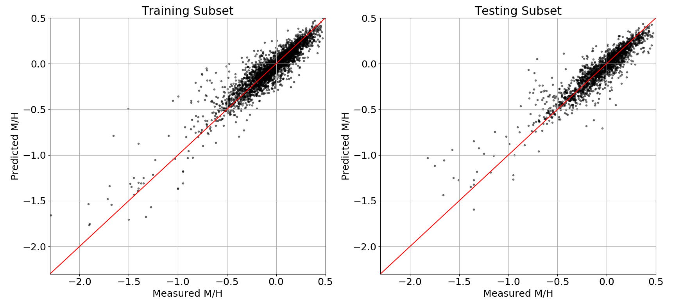

# Gaussian Process Regressor Metallicity Relationship for K and M Dwarfs

This provides the results of a Gaussian Process Regressor (implemented in [*scikit-learn*](https://scikit-learn.org/stable/modules/generated/sklearn.gaussian_process.GaussianProcessRegressor.html)) calibrated using photometry and astrometry from [*Gaia*](https://www.cosmos.esa.int/web/gaia/dr2), [2MASS](https://irsa.ipac.caltech.edu/Missions/2mass.html), [AllWISE](http://wise2.ipac.caltech.edu/docs/release/allwise/) and [Pan-STARRS](https://panstarrs.stsci.edu), and metallicity measurments from [APOGEE](https://www.sdss.org/surveys/apogee-2/) and [Hejazi et al. (2020)](https://iopscience.iop.org/article/10.3847/1538-3881/ab563c), as detailed in Medan, Lepine and Hartman (2020). These results include two calibrated relationships, one for stars of Luminosity Class V with temperatures 3500 < T < 5280 K and the other for stars of Luminosity Class V with temperatures 2850 < T < 3500 K. Both relationships are applicable over the metallicity range -2.3<[M/H]<0.5. From the training and testing subsets used to calbibrate the relationships, the 3500 < T < 5280 K sample resulted in a 1-sigma scatter of 0.11 dex from a 1-to-1 relationship:

and the 2850 < T < 3500 K sample resulted in a 1-sigma scatter of 0.19 dex from a 1-to-1 relationship:

This reprository will provide the resuting Gaussian Process Regressors, along with example code to estimate metallicities and errors on these estimates using both regressors. It should be noted that systemtic errors are present in the results from the 2850 < T < 3500 K (see Medan, Lepine and Hartman 2020), and this relationship should be used with such issues in mind.
